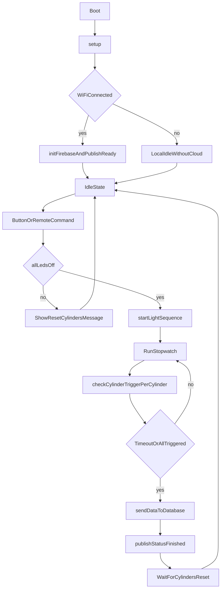

# ESP32 Lock-Picking Game Firmware Report

## 1) System Overview

This firmware runs an ESP32-based lock-picking game station with:

- **3 analog cylinders** (`cylinders[0..2]`) read from GPIO `32`, `35`, and `34`.
- **3 LEDs** (GPIO `14`, `12`, `13`) used as per-cylinder state indicators.
- **1 start/stop/reset button** on GPIO `15` with debounce logic.
- **20x4 I2C LCD** (`LiquidCrystal_I2C`) for game prompts, timer, and lap/cylinder times.
- **WiFi + Firebase Realtime Database** for remote command control and result/status publishing.
- **Local web server** (`WebServer` on port `80`) for browser-based command input (`/command`).

The game measures how quickly each cylinder is moved away from its calibrated baseline and logs per-cylinder times plus total run metadata.

## 2) Core Data Model and Runtime State

### `CylinderState` struct

Each cylinder stores:

- `pin`: analog input pin.
- `ledPin`: LED output pin.
- `norm`: calibrated baseline (computed once in `setup()`).
- `raw`: latest ADC reading.
- `mapped`: reading mapped to `0-100`.
- `triggered`: whether that cylinder was already "picked" in current run.
- `time`: timestamp (ms from run start) when cylinder first triggered.

### Important global state

- `stopwatchRunning`: game active/inactive flag.
- `startTime`: start time for current run.
- `gameID`: increments per start.
- `playerID`, `currentRound`, `currentGame`: metadata from command/web/Firebase paths.
- Debounce/press tracking: `buttonState`, `previousButtonState`, `lastDebounceTime`, `buttonPressStartTime`.
- Post-finish cleanup flags: `lapClearPending`, `lapClearStartTime`.
- Firebase polling/status timing: `lastCommandPollMs`, `lastStatusPublishMs`, and request-in-flight guards.

## 3) Startup Lifecycle (`setup()`)

At boot, `setup()` performs:

1. Serial, button, cylinder pins, and LED pin initialization.
2. LCD initialization and startup text display.
3. WiFi station-mode connection attempt using configured SSID/password.
4. If connected:
   - shows IP on LCD,
   - initializes SNTP time (`configTime`),
   - builds board path (`/boards/<boardID>`),
   - initializes Firebase (`initFirebase()`),
   - publishes initial board status (`publishStatus("ready")`).
5. Captures each cylinder baseline (`norm = analogRead(pin) / 40.95`).
6. Starts HTTP server and registers routes:
   - `/` -> `handleRoot()`
   - `/command` -> `handleCommand()`

## 4) Main Loop Responsibilities (`loop()`)

Each cycle, the firmware:

1. Reads button input and handles local HTTP requests.
2. Services Firebase app internals (`app.loop()`) and polls remote command path.
3. Attempts WiFi reconnect periodically if disconnected.
4. Logs free heap periodically.
5. Reads and maps cylinder analog values.
6. Updates cylinder LED/trigger baseline status via `checkLEDLight(...)`.
7. Applies pending web command (`receivedCommand`) through `applyCommand(...)`.
8. Executes debounced button logic for start/stop and long-press reset.
9. If running:
   - checks each cylinder trigger,
   - updates timer/lap display,
   - stops on timeout or all cylinders triggered,
   - pushes run data to Firebase.
10. If idle:
   - waits for all cylinders reset (LEDs off),
   - clears lap rows after stable reset delay,
   - displays ready messaging.
11. Publishes periodic status snapshots to Firebase.

## 5) Function Explanations by Group

### A. Game-State and Trigger Logic

- **`allCylindersTriggered()`**  
  Returns `true` only if all `cylinders[i].triggered` are `true`.

- **`allLedsOff()`**  
  Checks hardware LED pins to ensure all are LOW before allowing a new run.

- **`startLightSequence()`**  
  Displays "Get Ready" style LCD prompts and lights LEDs in sequence (1 sec, 1 sec, 2 sec), then turns all off. This is the run countdown.

- **`checkCylinderTrigger(CylinderState&)`**  
  During an active run, marks a cylinder as triggered the first time mapped value exits baseline window:
  - baseline window = `norm +/- THRESHOLD`
  - once crossed, stores `time = millis() - startTime` and turns that cylinder LED ON.

- **`checkLEDLight(CylinderState&)`**  
  Resets a cylinder visual state when value returns inside baseline window:
  - if inside window -> LED OFF, `triggered = false`, return `false`
  - otherwise returns current `triggered` state

- **`resetGameState()`**  
  Full reset path used by command or long-press:
  - stops stopwatch,
  - clears lap flags/times,
  - clears triggers and turns all LEDs off,
  - clears lap rows and displays reset/ready messages.

### B. Display and UX Helpers

- **`displayTimeOnLCD(...)`**  
  Formats elapsed ms to `MM:SS:CC` and prints `Timer:<value>` on line 0.

- **`displayLapTimesOnLCD()`** and **`displayLapTime(...)`**  
  Renders each cylinder time as `C1/C2/C3` on rows 1-3.

- **`clearLine(...)`, `setLine0(...)`, `clearLapRows()`**  
  Helpers to avoid stale characters and reduce unnecessary LCD rewrites.

- **`showStatusMessage(...)`, `showLine0Message(...)`, `showStartScreen(...)`**  
  Temporary status overlays for run-state communication.

### C. Firebase and Networking

- **`initFirebase()`**  
  Configures `WiFiClientSecure`, initializes app auth, and binds database URL.

- **`publishStatus(state)`**  
  Writes board status JSON to `/boards/<boardID>/status`, including:
  - state (`ready`, `running`, `finished`, `stopped`, `reset`)
  - run metadata (`gameID`, `playerID`, round/game strings)
  - last known times
  - updated timestamp in ms (device uptime).

- **`pollFirebaseCommand()`**  
  Polls `/boards/<boardID>/command` at interval with in-flight timeout protection.
  - Applies non-idle commands (`start`, `stop`, `reset`)
  - On `start`, also fetches player/round/game metadata
  - Resets command path back to `"idle"` after handling.

- **`sendDataToDatabase(...)`**  
  On run finish, pushes a result object to `/runs/<boardID>` containing:
  - total and per-cylinder times,
  - board/game/player metadata,
  - epoch + ISO timestamps.
  Also shows LCD success/failure message.

### D. Command and Utility Functions

- **`applyCommand(command)`**  
  Unified command executor for both web and Firebase commands:
  - `start` -> start sequence + stopwatch (if safe to start),
  - `stop` -> halt run,
  - `reset` -> full reset.

- **`handleRoot()`**  
  Serves minimal HTML UI to issue `start` command and pass `playerID`.

- **`handleCommand()`**  
  Reads query args (`command`, `playerID`) into runtime globals.

- **`jsonEscape(...)`**, **`getEpochSeconds()`**, **`getIsoTimestamp()`**  
  Utility helpers for safe JSON string payloads and timestamp enrichment.

## 6) End-to-End Operation Flow

## 7) Control Behavior Summary

### Start conditions

A run starts only when:

- start requested by local button or remote command (`start`), and
- all LEDs are OFF (cylinders considered reset).

### Stop conditions

A run stops when any of these occurs:

- local button pressed while running,
- remote `stop` command,
- timeout (`stopwatchLimit = 120000` ms),
- all cylinders triggered.

### Reset conditions

Reset occurs by:

- remote `reset` command, or
- local long-press > 10 seconds.

## 8) Practical Notes

- Baseline is a one-time calibration at boot (`norm`); gameplay relies on deviation from that baseline by `THRESHOLD`.
- `checkLEDLight(...)` supports reset readiness by turning LEDs off when cylinders return to baseline range.
- Status is periodically published even outside transitions (`STATUS_PUBLISH_INTERVAL_MS = 5000`).
- Firmware supports both cloud command control and local web/browser command injection.
